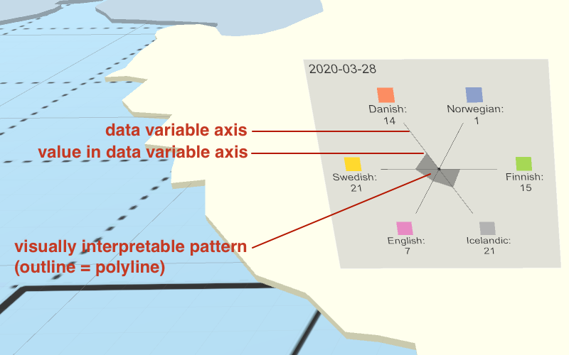
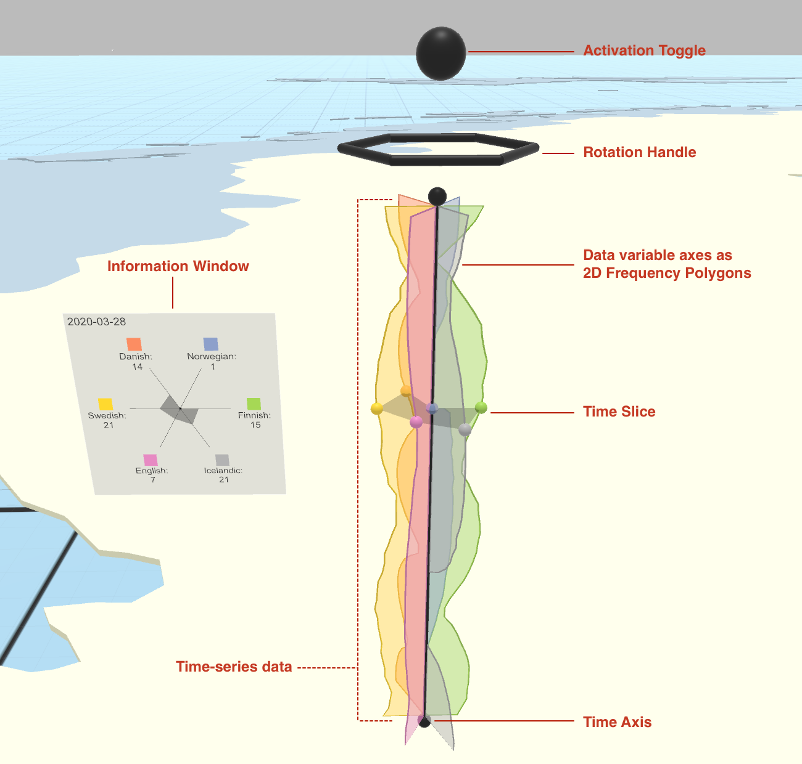
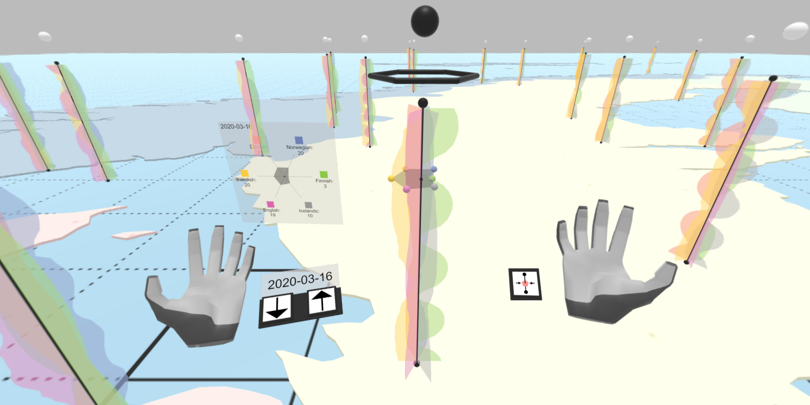
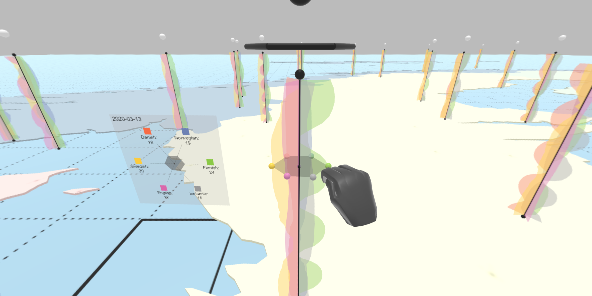
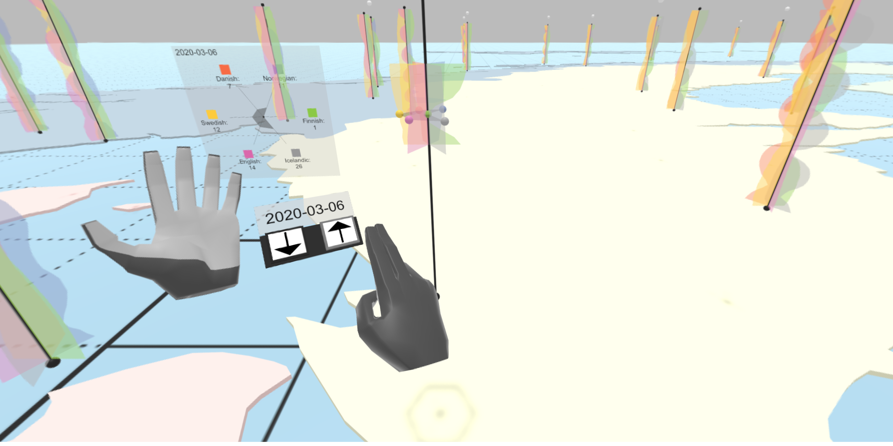
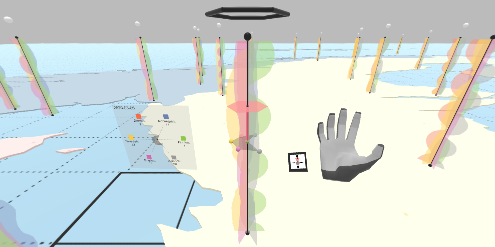
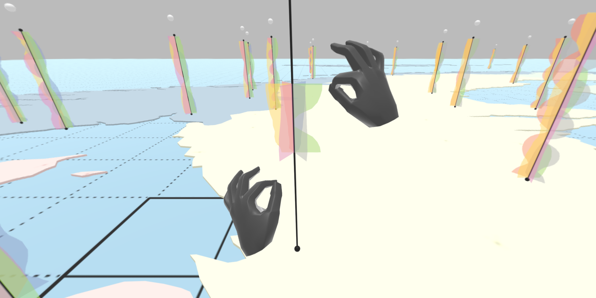

# Unity - 3D Radar Chart

The purpose of this project is to provide a data-agnostic software module for a three-dimensional (3D), interactive data visualization in the format of a **3D Radar Chart**, implemented for Unity3D.


#### Scientific Reference

The project presented here has been used within the following scientific publication:

* Reski, N., Alissandrakis, A., and Kerren, A. (to appear, full paper). Exploration of time-oriented data in immersive virtual reality using a 3D Radar Chart approach, in *Proceedings of The 11th Nordic Conference on Human-Computer Interaction* (NordiCHI 2020). October 25-29, 2020, Tallinn, Estonia. DOI: *TBA*

#### Background / Motivation

Some of my research interests evolve around the interaction with data in immersive environments, i.e., data visualized in computer-generated 3D environments that are viewed through immersive display technologies, for instance Virtual Reality (VR) headsets. In order to practically investigate such immersive data interaction (this area is commonly referred to as *Immersive Analytics* in the research community), I ended up implementing an interactive 3D data visualization approach as presented in this repository. 

#### Radar Chart concepts (2D and 3D)

The concept of a two-dimensional (2D) *radar chart*, also commonly known as *Kiviat figure* or *star plot*, can be traced back to [Kolence and Kiviat's work in 1973](https://doi.org/10.1145/1041613.1041614). Rather than presenting values of individual data variables perpendicular to one another (e.g., histogram, bar chart), they are first radially arranged as data variable axes, and then connecting the values for each data variable along the different adjacent axes by a polyline, resulting in a visually interpretable pattern.

The annotated screenshot below illustrates the concept of a (2D) *radar chart* (as part of the implemented software module presented here).



Over the years, many different approaches have been made attempting to transfer the concept of the (2D) *radar chart* into the 3D space, most often with the aim to utilize the additional graphical dimension to visualize further information. A common use case is to use that third additional dimension to visually encode time events, visualizing changes in the data over time by stringing together multiple (2D) radar charts in 3D along a (time) axis.

The annotated screenshot below illustrates the concept of such a *3D Radar Chart* as implemented in the software module presented here. It is notable that its concept and design are inspired and derived from [Akaishi and Okada's *Time-tunnel* approach as presented in 2004](https://doi.org/10.1109/IV.2004.1320184).



For further in-depth explanations, please refer to the scientific reference listed at the beginning.


## Features

* Visualization of *time-oriented data as a 3D Radar Chart*.
* Toggle of a *Time Slice* fur further inspection of the 3D Radar Chart's data variable axes and time-oriented data.
* Toggle of an *Information Window* for further inspection of the 3D Radar Chart's data variable axes and time-oriented data.
* *Rotation* of the 3D Radar Chart in place.
* Selection of a *Range* within the time-series data.
* Interaction through (1) only keyboard input (*basic*), and (2) Leap Motion hand controller in a VR setup (*extended*).
* Implementation: One class `ThreeDimRadarChartInterface.cs` as main interface for configuration and interaction with the 3D Radar Chart.
* Implementation: Input data (in `.csv` data format) can be loaded both from local or remote sources.
* Implementation: Color configuration (in `.csv` data format) for the input data's individual `dimension` values, coded in `hexadecimal` notation, can be loaded both from local or remote sources.
* Implementation: Individual data variable axes of the 3D Radar Chart are implemented as `FrequencyPolygons`, which have various configuration options as well (e.g., for data value scaling).
* Documentation: The source code for all involved classes and components is extensively documented directly within the source files.


## Dependencies

This project has been built using the following specifications (*basic*):

* [Unity3D](https://unity3d.com) 2019.2.17f1 Personal
* [Unity PolyExtruder](https://github.com/nicoversity/unity_polyextruder) for the purpose of dynamically creating 2D meshes used within several parts of the data visualization

In order to use the implemented virtual reality and Leap Motion support, the following specifications are required (*extended*):
* [Leap Motion Core Assets v.4.4.0](https://developer.leapmotion.com/unity)
* [Leap Motion Interaction Engine v.1.2.0](https://developer.leapmotion.com/unity)
* [SteamVR Plugin 1.2.3](https://assetstore.unity.com/packages/templates/systems/steamvr-plugin-32647)

External hardware specifications have been used with the following specifications (*extended*):
* [Leap Motion Orion](https://developer.leapmotion.com/setup) v.4.0.0+52173, Firmware Revision v.1.7.0
* [SteamVR](https://store.steampowered.com/steamvr), always up-to-date through Steam

*Note:* Generally, Unity source code should work also within their Windows counterparts. Please check out the above stated dependencies for troubleshooting.


## How to use

#### Import assets to Unity3D project

In order to add the features presented in this repository to your Unity3D project, I recommend to add the assets by simply importing one of the pre-compiled `.unitypackage` modules to your Unity project. Two different `.unitypackage` modules are provided:

1. `nicoversity-unity_3dradarchart-basic.unitypackage`: Contains the *3D Radar Chart* implementation for normal usage, without any immersive interfaces (no VR or Leap Motion assets and code are included). This is recommended for most users, who prefer to implement their own interaction mechanisms. An example for simple keyboard interaction is included. 
2. `nicoversity-unity_3dradarchart-extended.unitypackage`: Contains the *basic 3D Radar Chart* implementation, plus the extensions to support VR (SteamVR, i.e., HTC Vive) and Leap Motion hand controller interaction. *Note:* This `.unitypackage` comes pre-compiled with all necessary *SteamVR* and *LeapMotion* Unity assets as listed in the *Dependencies* section. 

Alternatively, the repository directory `unity_src` features a directory titled `Unity3DRadarChart`, containing the source code (Unity project) of the complete *3D Radar Chart* implementation (basically the exported contents of the `nicoversity-unity_3dradarchart-extended.unitypackage` module).

#### Input data

The directory `Assets/Resources/3D_Radar_Chart-resources/Data/` contains two `.csv` files, providing examples for (1) the actual input data used to be visualized as a 3D Radar Chart, and (2) the color configuration of the 3D Radar Chart's data variable axes.

Input data generally follows the format as illustrated within the code snippet below:

```cs
"dimension", "time", "value"
"myFirstDimenion", "2020-08-02", "23"
"myFirstDimenion", "2020-08-03", "28"
"mySecondDimenion", "2020-08-02", "42"
"mySecondDimenion", "2020-08-03", "33"
"myThirdDimenion", "2020-08-02", "70"
"myThirdDimenion", "2020-08-03", "77"
// ...
```

Color configuration data generally follows the format as illustrated within the code snippet below:

```cs
"dimension", "color"
"myFirstDimenion", "ffff00"
"mySecondDimenion", "ff00ff"
"myThirdDimenion", "00ffff"
// ...
```

#### ThreeDimRadarChartInterface.cs

A new instance of a 3D Radar Chart can be created, configured, and initialized dynamically at run-time from within the source code. An example of such is illustrated within the code snippet below. Please also have a look into the provided `Demo_3DRadarChart.cs` file for further illustration.

```cs
// properties related to the 3D Radar Chart instantiation
//

public Camera mainCamera;												// reference to the scene's main camera
private ThreeDimRadarChartInterface demo_TDRCInterface;					// reference to the 3D Radar Chart instance (for use after instantiation)
private static readonly string demo_TDRCInterfacePrefab = "3D_Radar_Chart-resources/Prefabs/TDRCInterface";		// reference to the 3D Radar Chart's GameObject Prefab (within the Unity Application's "Assets/Resources" directory)
public Vector3 demo_TDRCPosition;										// initial position of the 3D Radar Chart within the Scene, e.g., new Vector(23.0f, 0.5f, 42.0f)


// instantiate the 3D Radar Chart at run time, e.g., within the Start() function, or on-demand within the Update() function
//

// only instantiate if not already existing
if (demo_TDRCInterface == null && mainCamera != null)
{
    // instantiate new TDRCInterface GameObject (attached as a Child to the GameObject this script is attached to) and get reference to ThreeDimRadarChartInterface component
    demo_TDRCInterface = Instantiate(Resources.Load(demo_TDRCInterfacePrefab) as GameObject, this.transform).GetComponent<ThreeDimRadarChartInterface>();
    demo_TDRCInterface.name = "TDRCInterface_1";

    // AFTER instantiation _AND_ BEFORE INITIALIZATION: do additional custom configurations to the ThreeDimRadarChartInterface, e.g., set data source and data source color coding properties, configure data transformation related values (normalization, scaling), etc.
    // Note: Default configuration possible beforehand by editing the Prefab directly in the Resources directory using the Unity Inspector. (Recommendation: If done so, create a copy of the original Prefab for save keeping of original configuration.)
    //
    // Some configuration examples:
    //demo_TDRCInterface.dataSourceLocalFilePath = "3D_Radar_Chart-resources/data/sample_data-3dtimevis";
    //demo_TDRCInterface.isDataLoadedFromServer = false;
    //demo_TDRCInterface.cnfg2d_isFrequencyPolygonVisualizationNormalized = true;
    //demo_TDRCInterface.cnfg2d_frequencyPolygonMinimumDataValueForNormalization = 1;     // based on Resources/3D_Radar_Chart-resources/data/sample_data-3dtimevis
    //demo_TDRCInterface.cnfg2d_frequencyPolygonMaximumDataValueForNormalization = 36;    // based on Resources/3D_Radar_Chart-resources/data/sample_data-3dtimevis
    //demo_TDRCInterface.cnfg2d_frequencyPolygonNormalizationScaleFactor = 10.0f;
    //demo_TDRCInterface.cnfg2d_frequencyPolygonDataValueScaling = TDRCFrequencyPolygon.DataValueScaling.Linear;
    //demo_TDRCInterface.cnfg2d_linearScaleFactor = 0.25f;
    // ...

    // For a full list of configuration properties, please refer directly to the implementation/documentation in the ThreeDimRadarChart.cs file

    // initialize 3D Radar Chart (= load data and ready for user interaction)
    demo_TDRCInterface.initWithCameraAndPosition(mainCamera, demo_TDRCPosition);
}
```

#### Interaction: Keyboard

The source code snippet below illustrates basic interaction with a 3D Radar Chart instance using keyboard input.

```cs
// properties related to the 3D Radar Chart 
//

private ThreeDimRadarChartInterface demo_TDRCInterface;		// reference to the initialized 3D Radar Chart instance


// Example keyboard interaction, implemented within Unity's Update() function.
//

private void Update()
{
	// if 3D Radar Chart has been set up
    if (demo_TDRCInterface != null)
    {
        // A - toggle activation state
        if (Input.GetKeyDown(KeyCode.A))
        {
            demo_TDRCInterface.triggerActivationToggle();
        }

        // RIGHT / LEFT ARROW KEY - manual rotation of the Rotation Handle
        if (Input.GetKeyDown(KeyCode.RightArrow))
        {
            demo_TDRCInterface.interact_rotationHandle.rotateRight(demo_TDRCInterface.cnfgRotHndl_manualRotationEulerAngle);
        }
        if (Input.GetKeyDown(KeyCode.LeftArrow))
        {
            demo_TDRCInterface.interact_rotationHandle.rotateLeft(demo_TDRCInterface.cnfgRotHndl_manualRotationEulerAngle);
        }

        // UP / DOWN ARROW KEY - move Time Slice up and down by one index along the time-series axis
        if (Input.GetKeyDown(KeyCode.UpArrow))
        {
            demo_TDRCInterface.timeSliceMoveUpOneIndex();
        }
        if (Input.GetKeyDown(KeyCode.DownArrow))
        {
            demo_TDRCInterface.timeSliceMoveDownOneIndex();
        }

        // S - iterate through Time Range Selection states
        if (Input.GetKeyDown(KeyCode.S))
        {
            demo_TDRCInterface.timeRangeSelector.iterateTimeRangeSelectionState();
        }
    }
}
```

#### Interaction: Leap Motion

##### Configure ThreeDimRadarChartInterface to enable Leap Motion Interaction

Generally, follow the overall flow of instantiation, configuration, and initialization of the `ThreeDimRadarChartInterface.cs` as described above, under consideration of the follow two edits:

```cs
// (1) The main camera needs to be set up to refer to the VR headset's camera in the Inspector, e.g., ... "[Camera Rig] -> Camera (head) -> Camera (eye)" in case of using the provided SteamVR assets
public Camera mainCamera;	// reference to the scene's main VR camera

// (2) AFTER instantiation _AND_ BEFORE INITIALIZATION: turn on support for Leap Motion interaction
demo_TDRCInterface.cnfgVRLM_isEnabled = true;
```

##### VirtualRealityLeapMotionInterface.cs

The `VirtualRealityLeapMotionInterface.cs` script, attached as a component, to the `VRLM_Player` prefab functions as the main interface for all VR and Leap Motion related interactions. Please use this script as a starting point in order to gain further insights in its (and all other related components) implementation.

#### Further documentation

All Unity3D scripts in this project are well documented directly within the source code. Please refer directly to the individual scripts to gain a better understanding of the implementation in detail.

Additionally, the following `Scenes` are provided for demonstrative purposes:
* `3DRadarChart-basic`: Basic, non-immersive setup.
* `3DRadarChart-extended`: Extended setup to support VR and Leap Motion interaction.

For both provided `Scenes`, please have a look into the `Demo_3DRadarChart.cs` script to gain a practical usage example in source code.


## Media

### Screenshots - Extended (VR and Leap Motion Interaction)

#### VR and Leap Motion Setup - Overview


#### Time Slice movement via Leap Motion Grab interaction


#### Time Slice movement via Leap Motion Hand Menu


#### Time Range Selection via Leap Motion Hand Menu


#### Time Range Selection via Leap Motion Two-Hand Pinch interaction


### Annotated, interactive 360 degree web viewer

As part of my work within our university's research group, an annotated, interactive 360 degree web viewer is available online, demonstrating immersive visualization and interaction with the 3D Radar Chart: [vrxar.lnu.se/apps/radartimeui-360/](https://vrxar.lnu.se/apps/radartimeui-360/)

*Note:* The *Annotation Menu* button of the right-hand menu is *not* part of of the project presented here.

### Video demo

A video illustrating the 3D Radar Chart is available online: [vimeo.com/vrxar/vr-3dradarchart-wip2020](http://vimeo.com/vrxar/vr-3dradarchart-wip2020)

*Note:* The *Annotation Menu* button of the right-hand menu is *not* part of of the project presented here.


## Known issues / Areas for further development

1. Numerical input data values (`value`) currently implemented to handle `int` data type values. Support for `float` data types could be implemented in the future.

2. Interaction with multiple 3D Radar Charts in the Scene (setting focus, managing charts' state, etc.) should be adjusted based on own preferences and needs. Implementation in `VirtualRealityLeapMotionInterface.cs` could be a good starting point.


## License
MIT License, see [LICENSE.md](LICENSE.md)
